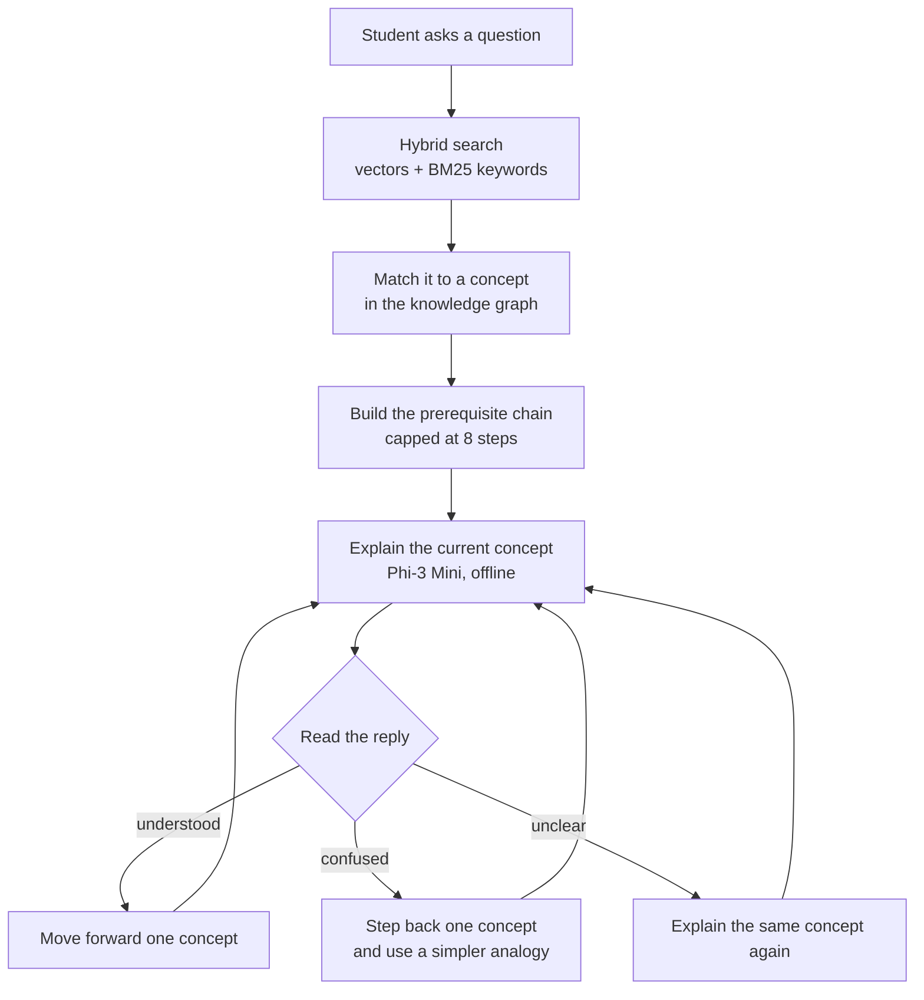

<div align="center">

# Vidhya-Setu

**An offline AI tutor that teaches the prerequisites first, not just the answer.**

GraphRAG based adaptive tutoring for NCERT Class 9 Science. Runs on a single
laptop with no internet, no cloud API and no running cost.


</div>

---

## The problem it solves

A student who cannot follow acceleration usually has a gap further back, in
velocity or in speed. A normal chatbot answers the question that was asked and
the gap stays. Vidhya-Setu finds the gap and walks the student up to the answer.

Ask it about **acceleration** and it does not start with acceleration:

```
mass  ->  motion  ->  speed  ->  velocity  ->  momentum  ->  force  ->  net force  ->  acceleration
```

That chain is not written by hand. It is read out of a knowledge graph the
system builds from the textbook itself.

Say "I don't understand" at any point and it steps **back** one concept and
re-explains with a simpler analogy. Say "got it" and it moves forward.

---

## How a session works



The session is written to disk after every exchange, so a power cut costs at
most one turn.

Everything above the tutoring loop is build work that runs once on a developer
machine. The school machine only loads the finished graph, the index and the
model.

| Stage | Runs | What it produces |
|---|---|---|
| Ingestion | Build time | Clean text chunks from NCERT PDFs |
| Triple extraction | Build time | Concept and prerequisite pairs, using a GBNF grammar so the output is always valid JSON |
| Graph construction | Build time | `kg.pkl`, a cycle free DAG |
| Indexing | Build time | `embeddings.npy` and `chunks.json` |
| Tutoring | Every session | Explanations, routing, session checkpoints |

---

## Quick start

```bash
git clone https://github.com/Swaraj-Mandre/IEEE.git
cd IEEE
python -m venv .venv && .venv\Scripts\activate.bat
pip install -r requirements.txt
```

Download the model (2.4 GB, one time):

```bash
python -c "from huggingface_hub import hf_hub_download; hf_hub_download(repo_id='microsoft/Phi-3-mini-4k-instruct-gguf', filename='Phi-3-mini-4k-instruct-q4.gguf', local_dir='models')"
```

Copy `.env.example` to `.env`, then build the search index and start the tutor:

```bash
python scripts/build_vectorstore.py
python src/ui/app.py
```

Open `http://127.0.0.1:7860`. Each browser tab is a separate student session.

---

## Commands

| Command | What it does | Time |
|---|---|---|
| `python src/ui/app.py` | Start the tutor | 10 s to load |
| `python scripts/run_checks.py` | 46 regression checks, no model loaded | under 1 min |
| `python scripts/build_vectorstore.py` | Rebuild the search index | 30 s |
| `python scripts/run_ingestion.py` | PDFs to text chunks | 1 min |
| `python scripts/run_kg.py` | Rebuild the knowledge graph | 17 min on CPU |
| `python scripts/run_agent_test.py` | End to end smoke test, loads the model | 2 min |

To add a chapter: drop the PDF in `data/raw_pdfs/`, add its chunk file to
`CHUNK_FILES` in `src/config.py`, then run ingestion, graph and index in that
order.

---

## What is inside

Built from NCERT Class 9 Science, Chapter 4 (Describing Motion) and Chapter 6
(How Forces Affect Motion).

| | |
|---|---|
| Source chunks | 301 |
| Concepts in the graph | 175 |
| Prerequisite links | 197 |
| Links confirmed by 2 or more chunks | 43 |
| Cycle free DAG | Yes |
| Most connected concept | `force`, degree 24 |
| Graph file | 24 KB |
| Search index | 0.63 MB |
| Retrieval time | about 18 ms |

Strongest links the extractor found, ranked by how many chunks back them up:

| Prerequisite | Concept | Chunks |
|---|---|---|
| velocity | acceleration | 28 |
| force | acceleration | 16 |
| mass | force | 14 |
| motion | force | 9 |
| velocity | velocity-time graph | 7 |

Full edge list: [`data/graph/kg_audit.json`](data/graph/kg_audit.json).
Sample for manual review: [`data/graph/kg_sample_review.json`](data/graph/kg_sample_review.json).

---

## Stack

| Layer | Choice | Why this one |
|---|---|---|
| Language model | [Phi-3 Mini 3.8B Q4_K_M](https://huggingface.co/microsoft/Phi-3-mini-4k-instruct-gguf) via [llama-cpp-python](https://github.com/abetlen/llama-cpp-python) | MIT licensed, so the product can be sold. Runs on CPU. |
| Structured output | [GBNF grammar](https://github.com/ggml-org/llama.cpp/blob/master/grammars/README.md) | Invalid JSON becomes impossible during sampling, not just unlikely |
| Knowledge graph | [NetworkX](https://networkx.org/) | Pure Python, pickles to 24 KB |
| Search index | numpy + [rank-bm25](https://github.com/dorianbrown/rank_bm25) | 301 chunks is small enough for exact search. Two plain files, nothing to migrate later. |
| Embeddings | [BGE-small-en-v1.5](https://huggingface.co/BAAI/bge-small-en-v1.5) | 384 dimensions, strong on short queries |
| Ranking | [Reciprocal rank fusion](https://plg.uwaterloo.ca/~gvcormac/cormacksigir09-rrf.pdf) | Merges vector and keyword results by rank, because their scores are not comparable |
| PDF parsing | [pymupdf4llm](https://pymupdf.readthedocs.io/en/latest/pymupdf4llm/) | Keeps section headings, which the extractor uses as hints |
| Interface | [Gradio](https://www.gradio.app/) | Browser UI with no frontend build step |

Nothing calls the network at runtime. The full check suite passes with
`HF_HUB_OFFLINE=1` and `TRANSFORMERS_OFFLINE=1`.

---

## Hardware

Measured on Windows 11, CPU only, 4 threads.

| | |
|---|---|
| RAM after loading | 3.9 GB |
| RAM peak during one explanation | 5.1 GB |
| **Practical minimum** | **8 GB RAM** |
| Disk | 2.4 GB, nearly all of it the model file |
| Explanation speed | about 15 s for 120 words |

The model accounts for almost all of that. The graph, the search index and the
BM25 index together come to about 20 MB.

---

## Layout

```
src/
  config.py        paths and model settings, read from .env
  ingestion/       PDF extraction and chunking
  graph/           triple extraction, graph build, cycle removal
  retrieval/       hybrid retriever, search index, path tracker
  agents/          instructor and diagnostic
  ui/app.py        Gradio interface
scripts/           pipeline runners and checks
data/
  chunks/          extracted text
  graph/           kg.pkl and audit files
  vectorstore/     search index, not tracked, build locally
  sessions/        student checkpoints, not tracked
```

---

## Limitations

These are known and measured, not guesses.

- **Two chapters only.** Everything else in the syllabus is future work.
- **Coverage follows the textbook.** `inertia` shows up in one chunk across both
  chapters, so it never became a node. Adding Chapter 5 would fix it.
- **Singular and plural are separate nodes.** `surface` and `surfaces` are two
  concepts. Merging them needs stemming, which is not in yet.
- **The diagnostic agent is rule based.** It matches phrases like "I don't
  understand" rather than judging comprehension. Fast and predictable, but an
  unusual reply gets labelled unclear and the concept is simply re-explained.
- **Needs 8 GB RAM, not the 4 GB originally targeted.** Getting under 4 GB means
  a smaller model, and that trade-off has not been tested.
- **English only.**
- **No BLEU or ROUGE numbers yet.** Validation so far is 46 automated checks
  plus manual review of the graph.

---

## Licensing

Source code in this repository is **MIT**. See [LICENSE](LICENSE).

Dependencies:

| Component | License | Commercial use |
|---|---|---|
| Phi-3 Mini | MIT | Yes |
| BGE-small-en-v1.5 | MIT | Yes |
| llama-cpp-python, langchain-text-splitters | MIT | Yes |
| Gradio, sentence-transformers, rank-bm25 | Apache 2.0 | Yes |
| NetworkX, numpy, python-dotenv | BSD | Yes |
| **PyMuPDF and pymupdf4llm** | **AGPL-3.0 or paid Artifex licence** | **Read below** |

**One thing to know before selling this.** PyMuPDF is AGPL-3.0. It runs only in
`scripts/run_ingestion.py` when you turn PDFs into chunks. It never runs on a
school machine. So a deployed tutor does not carry AGPL, but this repository
does, because the ingestion code lives here. Before shipping a closed source
product, either buy the [Artifex commercial licence](https://artifex.com/licensing/)
or swap PyMuPDF for an MIT alternative such as
[pdfplumber](https://github.com/jsvine/pdfplumber).

**Textbook content.** NCERT material is copyright of the National Council of
Educational Research and Training, Government of India. Source PDFs are not
tracked in this repository. Get them from
[ncert.nic.in](https://ncert.nic.in/textbook.php).
