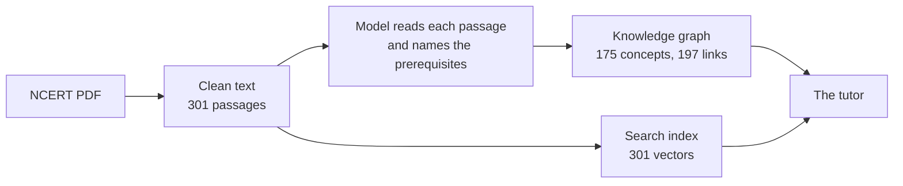
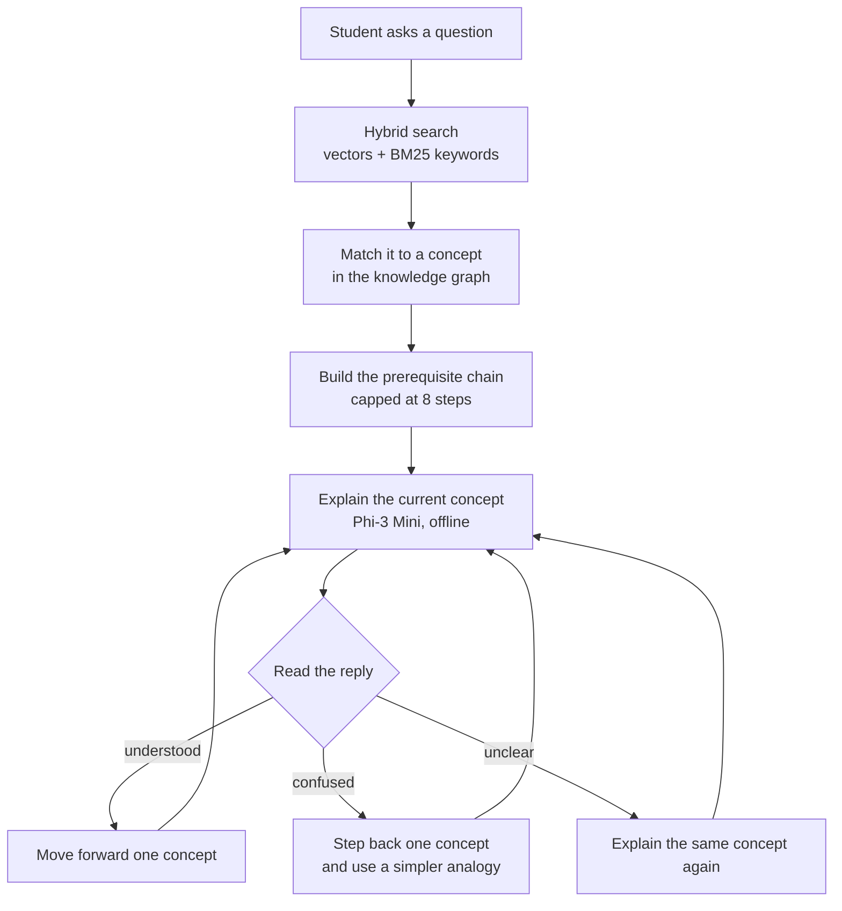

<div align="center">

# Vidhya-Setu

**An offline AI tutor that teaches the prerequisites first, not just the answer.**

GraphRAG based adaptive tutoring for NCERT Science, built from two Class 9 chapters.
Runs on one ordinary laptop. No internet, no cloud API, no running cost.


</div>

---

## The idea

A student who cannot follow **acceleration** usually has a gap further back, in
velocity or in speed. Answer the question they asked and the gap stays. Next
week it breaks something else.

So Vidhya-Setu does not start at the answer. Ask it about acceleration and it
builds this path first:

```
mass  ->  motion  ->  speed  ->  velocity  ->  momentum  ->  force  ->  net force  ->  acceleration
```

Nobody wrote that chain by hand. The system read the textbook, worked out which
concept depends on which, and stored it as a knowledge graph. The chain is a
walk through that graph.

Then it teaches one step at a time and watches the replies. Say "I don't
understand" and it goes **backwards** to an easier concept and tries a simpler
analogy. Say "got it" and it moves on.

---

## Why not just use a chatbot

| What matters in a school | Cloud chatbot | Vidhya-Setu |
|---|---|---|
| Answers the question asked | Yes | Yes |
| Finds the gap behind the question | No | Yes |
| Works with no internet | No | Yes |
| Runs on an old school desktop | No | Yes |
| Student data leaves the building | Yes | Never |
| Cost per student, per year | Subscription | Nothing |
| Answers stay tied to the textbook | No | Yes, every explanation is grounded in NCERT text |

---

## From a PDF to a tutor

This part runs once, on a developer machine. Point it at a chapter PDF and it
does the rest by itself.



The hard step is the third one. A small model asked for free-form JSON returns
broken JSON often enough to ruin a batch, so the extractor uses a grammar that
makes invalid output impossible while the model is still generating. Anything
the model invents that is not actually in the passage gets dropped afterwards,
and circular links are removed before the graph is saved.

Three commands, about twenty minutes, and a new chapter is live.

---

## How a lesson runs

This is what happens on the school machine, with no network.



The session is saved after every exchange, so a power cut costs at most one
turn, and the student picks up where they left off.

---

## Quick start

```bash
git clone https://github.com/Swaraj-Mandre/Vidhya-Setu.git
cd Vidhya-Setu
python -m venv .venv
.venv\Scripts\activate.bat      # Windows
source .venv/bin/activate       # macOS or Linux
pip install -r requirements.txt
```

Download the model, 2.4 GB, one time only:

```bash
python -c "from huggingface_hub import hf_hub_download; hf_hub_download(repo_id='microsoft/Phi-3-mini-4k-instruct-gguf', filename='Phi-3-mini-4k-instruct-q4.gguf', local_dir='models')"
```

Copy `.env.example` to `.env`, build the search index, start the tutor:

```bash
python scripts/build_vectorstore.py
python src/ui/app.py
```

Open `http://127.0.0.1:7860`. Every browser tab is a separate student.

---

## Commands

| Command | What it does | Time |
|---|---|---|
| `python src/ui/app.py` | Start the tutor | 10 s to load |
| `python scripts/run_checks.py` | Run the full test suite, no model needed | under 1 min |
| `python scripts/build_vectorstore.py` | Rebuild the search index | 30 s |
| `python scripts/run_ingestion.py` | Turn PDFs into text chunks | 1 min |
| `python scripts/run_kg.py` | Rebuild the knowledge graph | 17 min on CPU |
| `python scripts/run_agent_test.py` | End to end smoke test | 2 min |

**To add a chapter:** put the PDF in `data/raw_pdfs/`, add its chunk file to
`CHUNK_FILES` in `src/config.py`, then run ingestion, graph and index in that
order.

---

## What is inside

Three things do the real work. Everything else is code that builds them or
reads them.

| Piece | What it is | Size |
|---|---|---|
| **The knowledge graph**<br/>`data/graph/kg.json` | 175 concepts joined by 197 "learn this one first" links, pulled out of the textbook by the model | 67 KB |
| **The search index**<br/>`data/vectorstore/` | 301 passages of NCERT text, stored so the system can find the right one in milliseconds | 0.63 MB |
| **The language model**<br/>`models/*.gguf` | Phi-3 Mini, writes the actual explanations. Downloaded separately | 2.4 GB |

Currently built from Class 9 Science, Chapter 4 (Describing Motion) and
Chapter 6 (How Forces Affect Motion).

**Is the graph any good?** It was written by a model, so that is a fair
question. Three things say yes:

- **No circular logic.** The graph is a proper DAG, so a concept can never end
  up being its own prerequisite.
- **43 links are backed by two or more separate passages** in the textbook, not
  a single lucky sentence.
- **The busiest concept is `force`, with 24 links.** For two chapters about
  motion and forces, that is exactly what it should be.

The strongest links it found, ranked by how many passages support each one:

| Learn this first | Before this | Passages agreeing |
|---|---|---|
| velocity | acceleration | 28 |
| force | acceleration | 16 |
| mass | force | 14 |
| motion | force | 9 |
| velocity | velocity-time graph | 7 |

Every link is listed in [`kg_audit.json`](data/graph/kg_audit.json), with a
smaller hand-checkable sample in [`kg_sample_review.json`](data/graph/kg_sample_review.json).

---

## Stack

| Layer | Choice | Why this one |
|---|---|---|
| Language model | [Phi-3 Mini 3.8B Q4_K_M](https://huggingface.co/microsoft/Phi-3-mini-4k-instruct-gguf) via [llama-cpp-python](https://github.com/abetlen/llama-cpp-python) | Small enough for CPU, good enough to teach |
| Structured output | [GBNF grammar](https://github.com/ggml-org/llama.cpp/blob/master/grammars/README.md) | Broken JSON becomes impossible during sampling, not just unlikely |
| Knowledge graph | [NetworkX](https://networkx.org/) | Pure Python, and the whole graph saves to a 67 KB JSON file you can read by eye |
| Search | numpy + [rank-bm25](https://github.com/dorianbrown/rank_bm25) | 301 passages is small enough for exact search. Two plain files, no database to migrate later. |
| Embeddings | [BGE-small-en-v1.5](https://huggingface.co/BAAI/bge-small-en-v1.5) | 384 dimensions, strong on short questions |
| Ranking | [Reciprocal rank fusion](https://plg.uwaterloo.ca/~gvcormac/cormacksigir09-rrf.pdf) | Merges keyword and meaning results by rank, because their scores are not comparable |
| PDF parsing | [pymupdf4llm](https://pymupdf.readthedocs.io/en/latest/pymupdf4llm/) | Keeps section headings, which the extractor uses as hints |
| Interface | [Gradio](https://www.gradio.app/) | Browser UI with no frontend build step |

Nothing reaches the network at runtime. The full test suite passes with
`HF_HUB_OFFLINE=1` and `TRANSFORMERS_OFFLINE=1` set.

---

## Hardware

Measured on Windows 11, CPU only, 4 threads.

| Resource | Needed |
|---|---|
| RAM, idle | 3.9 GB |
| RAM, peak while explaining | 5.1 GB |
| **Recommended** | **8 GB RAM** |
| Disk | 2.4 GB, nearly all of it the model |
| GPU | Not required |
| Internet | Not required |
| Speed | About 15 s to write a 120 word explanation |

---

## Roadmap

- [x] Class 9 Science, Chapter 4 and Chapter 6
- [x] Automatic knowledge graph from raw PDFs
- [x] Backtracking tutor loop
- [x] Multiple students at once
- [ ] Rest of the Class 9 syllabus
- [ ] Class 10 Science
- [ ] Hindi and Marathi
- [ ] Teacher view showing where a class is getting stuck
- [ ] One click installer for school machines

---

## License

Copyright (C) 2026 Vidhya-Setu.
Released under the **[GNU Affero General Public License v3.0](LICENSE)**.

In plain terms:

- **Schools and students:** use it, run it, change it, share it. Free, forever.
- **Developers:** fork it and build on it, as long as your version stays open
  under the same license.
- **What you cannot do:** take this work, close the source and sell it as your
  own product. That applies to running it as a hosted service too.

Every library used here is compatible with this license.

NCERT textbook content belongs to the National Council of Educational Research
and Training, Government of India. Source PDFs are not included in this
repository. Download them from [ncert.nic.in](https://ncert.nic.in/textbook.php).
